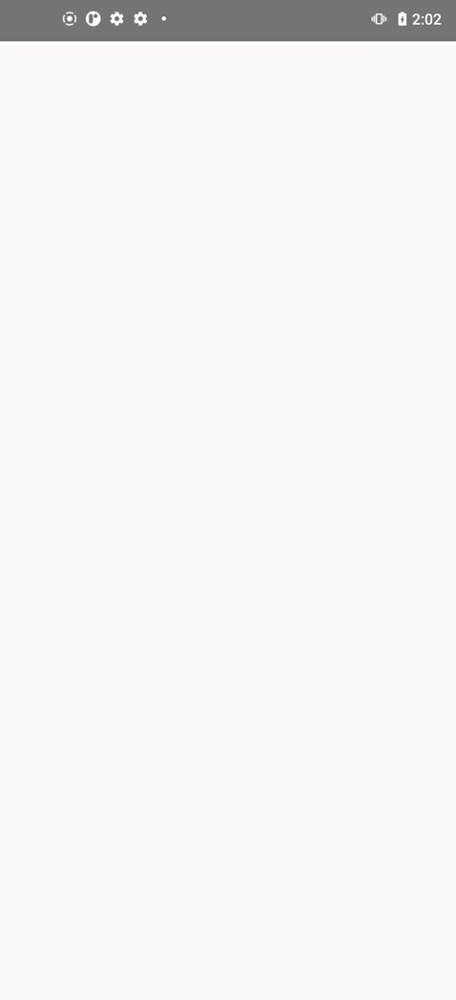

# Racebox BLE Demonstration
This is a demonstration using the Racebox BLE protocol to fetch raw data using an Android device. Racebox already comes with their proprietory application with many features but this is for those that want to customize the UI or develop their own application.
Racebox provides a BLE prototcol documentation which can be obtained here: [Application Form](https://www.racebox.pro/products/mini-micro-protocol-documentation) 

I initially tried to create this application on an iPhone but using bluetooth libraries requires an Apple developer account (paid subscription). For ease of implementation and cheaper hardware cost I chose to make this on Android.

## Demo


## Hardware Setup
This code was tested with the following hardware:
- Moto G Stylus (2021) on Android 11
- Racebox Mini S
- USB A to C cable (for connecting computer to phone)

## Software Environment Setup
* Node.js (https://nodejs.org/) 
    * Install LTS version (e.g., 18.x or 20.x)
* Git (https://git-scm.com/)
    * Required for React Native CLI and dependencies
* Android Studio (https://developer.android.com/studio)
    * Required for Android SDK
* Java SDK 17 - LTS (https://adoptium.net/en-GB/temurin/releases?version=17&os=any&arch=any)
    * Must download Temurin 17.0.15+6

``` 
Add to Variable:

ANDROID_HOME = C:\Users\<YourName>\AppData\Local\Android\Sdk

Add to Path:

%ANDROID_HOME%\emulator
%ANDROID_HOME%\platform-tools
%ANDROID_HOME%\tools
%ANDROID_HOME%\tools\bin
``` 

* Install Dependencies

`npm install -g react-native-cli`

`npm install react-native-ble-plx`


## Run App
1. Enable developer mode 
- Go to Settings > About phone
- Tap Build number 7 times until it says “You’re a developer!”
- Go to Settings > Developer options > USB Debugging → Turn it ON
2. Connect phone to computer via USB C cable
Verify phone is recognized by computer: `adb devices`
3. Go to the root folder of the project and run:
`npx react-native run-android`
